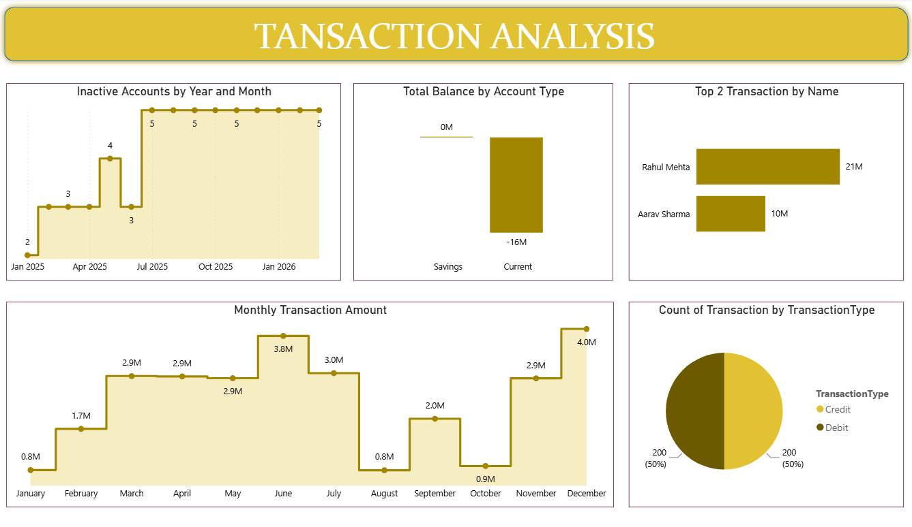
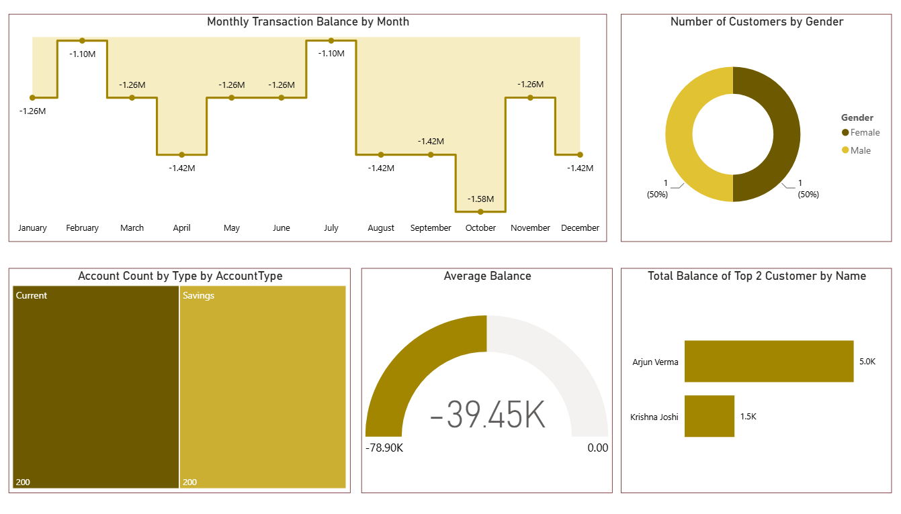

# 📊 IntelliBank - AI-Powered Transaction Analysis Dashboard

## 📌 Overview
IntelliBank is a data analytics project that leverages AI-generated datasets to analyze banking transactions, customer behavior, and account performance using Power BI.

---

## 🛠️ Tech Stack
- SQL (SSMS)
- Power BI
- Power Query Editor
- Perplexity AI (for data generation)

---

## 🚀 How to Use
1. Clone or download this repository  
2. Open the `.pbip` file in Power BI Desktop  
3. Ensure `Report` and `SemanticModel` folders are present  
4. Refresh data if needed  

---

## 📊 Key Features
- Monthly transaction trends and balance analysis  
- Inactive account tracking over time  
- Customer segmentation by gender  
- Transaction type distribution (Credit/Debit)  
- Account type analysis (Savings vs Current)  
- Top customers based on transactions and balance  

---

## 🔄 Data Workflow
- Dataset generated using AI (Perplexity) with SQL logic  
- Data stored and managed using SQL Server  
- Data cleaning and transformation using Power Query  
- Dashboard creation and visualization in Power BI  

---

## 📸 Dashboard Preview

### 📊 Dashboard 1

### 📊 Dashboard 2

---

## 💡 Insights
- Identified transaction patterns across months  
- Detected inactive accounts for monitoring  
- Analyzed customer distribution and behavior  
- Compared account types and their balances  

---

## 📬 Contact
Feel free to connect with me for feedback, collaboration, or opportunities!  
